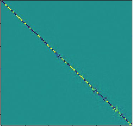
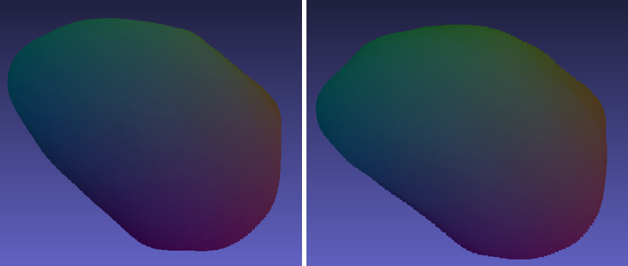

# Point-to-Point Correspondence

This repository facilitates surface point-to-point correspondence utilizing the [ZoomOut](https://arxiv.org/abs/1904.07865) method. It wraps the ZoomOut implementation from [PyFM](https://github.com/robinmagnet/pyFM) and exposes the `get_correspondence` function for making predictions. Configuration options are provided through the `get_default_config` function, offering a dictionary of default parameters that can be passed to `get_correspondence`.


## Installation

You can install the package using pip:
```bash
pip install git+github.com/shaharzuler/flow_n_corr_utils.git
```

## Usage

Here's a basic usage example:

```python
import p2p_correspondence
from easydict import EasyDict

mesh1_path = "path/to/mesh1.off"
mesh2_path = "path/to/mesh2.off"
# Generate default configuration, read config file from src/default_config.json
config = p2p_correspondence.get_default_config()
# Perform point correspondence inference
inference_path, flow_is_valid = p2p_correspondence.get_correspondence(mesh1_path, mesh2_path, EasyDict(config))
```
For a detailed usage example, please refer to `run.py`.


## Outputs
The model inference generates the following outputs:
- **P (Point Correspondence Confidence Matrix)**: Both point clouds along with the confidence matrix are written to an HDF5 file. You can use the [`get_point_clouds_and_p_from_h5`](https://github.com/shaharzuler/flow_n_corr_utils/blob/main/flow_n_corr_utils/src/utils/h5_utils.py#L13C5-L13C35) function to read the file.
- **Visualization**: Corresponding .obj files for both point clouds with color representations are saved in the output folder. Additionally, the confidence matrix C visualization is saved.

### Example for C matrix:
The confidence matrix visualizes the reliability of correspondences between points represented by functional maps (FM) on both surfaces, with values ranging from 0 (dark, low confidence) to 1 (yellow, high confidence). I



### Example for Color Representation for Correspondence:
Each point on the first point cloud is colored the same as its corresponding point on the second point cloud.



## Full Implementation

For a comprehensive implementation of our paper, utilizing this package along with additional functionalities, please refer to [CardioSpectrum](https://github.com/shaharzuler/CardioSpectrum) implementation.

